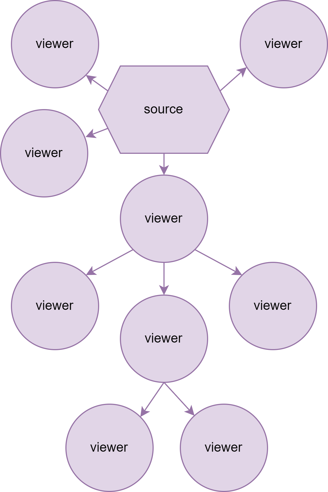
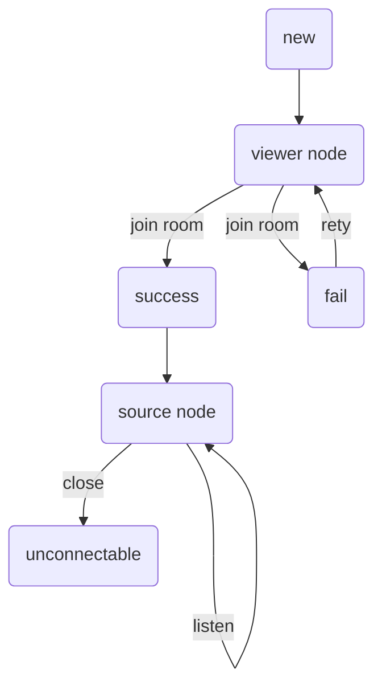
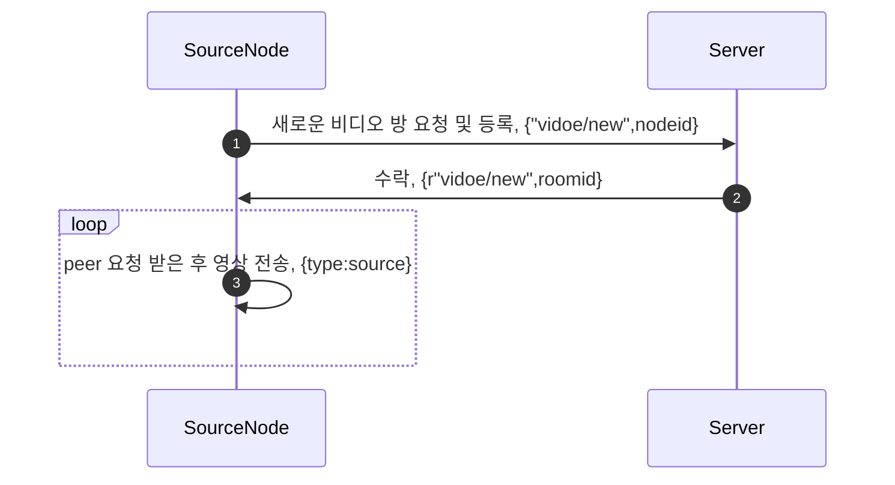
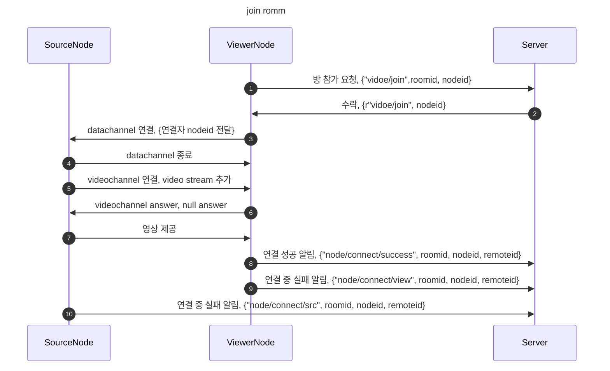
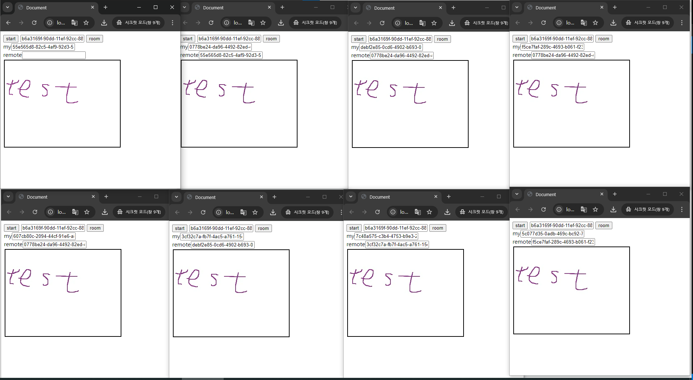

# GVOWR
webrtc를 이용한 그리드 영상 공유  

## 목적
webrtc를 이용한 영상 공유에서 n명에게 n개의 연결 대신 n/k개의 연결을 통하여 영상 공유  
기본적인 개념은 일종의 그리드 시스템을 webrtc 위에 구현  

## 구현 내용
1. 처음 영상을 공유할 노드는 새로운 방을 만들고 자신을 등록
2. 영상을 볼 노드는 방 참여 요청을 보내고 연결한 노드 아이디를 획득
3. peerjs 를 통하여 노드 아이디로 영상 소스 노드와 연결
4. 영상 획득을 서버에 알리고 자신을 연결 가능한 노드로 등록
5. 이후에 연결되는 노드는 등록된 노드에서 점수(현재는 노드 깊이*연결 수)를 계산, 한계값 보다 낮은 점수 중 가장 높은 점수를 가진 노드를 선택

-- 기본 노드 흐름

-- src 노드 흐름

-- viewer 노드 흐름

